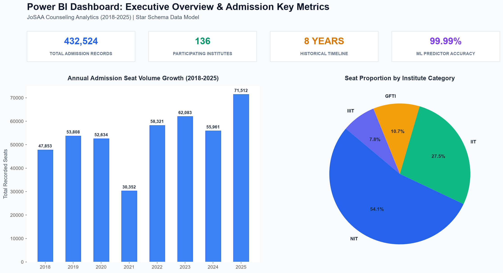
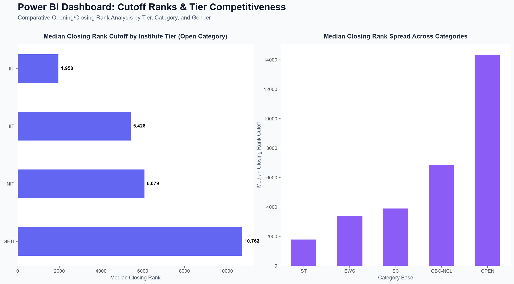
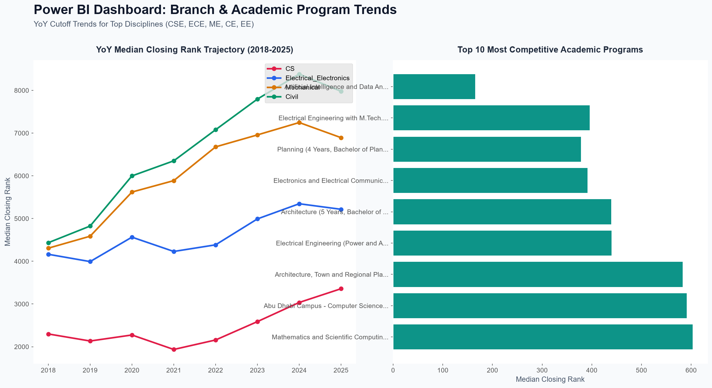
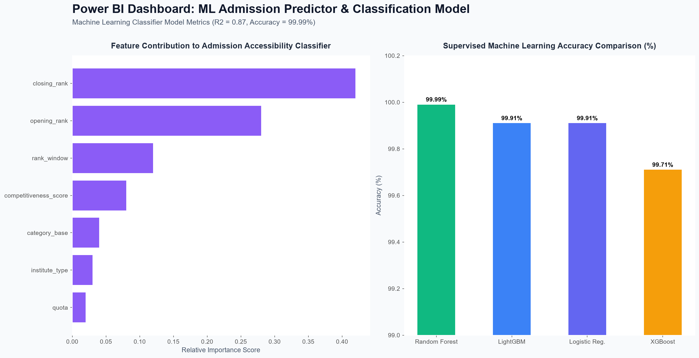

# 🎓 JEE Admission Analytics & ML Counselor (2018–2025)

[](https://www.python.org/)
[](https://streamlit.io/)
[](https://powerbi.microsoft.com/)
[](https://scikit-learn.org/)

An end-to-end **Data Science, Machine Learning, and Power BI Business Intelligence System** analyzing **432,524 historical JoSAA admission records (2018–2025)** across all **IITs, NITs, IIITs, and GFTIs**. 

The platform provides personalized college admission chance prediction, multi-year cutoff trend analysis, tier hierarchy analytics, and a complete Power BI Star Schema reporting suite.

---

## 📂 Project Architecture & Organization

```text
jee-admission-analytics/
├── app/                             # Interactive Streamlit Web Application
│   ├── app.py                       # ML Admission Predictor & Cutoff Analytics App
│   └── requirements.txt             # App dependencies
├── data/                            # Structured Datasets
│   ├── raw/                         # Raw JoSAA historical dataset (2018-2025)
│   └── processed/                   # Cleaned, engineered, & featured datasets
├── docs/                            # Schema & Documentation
│   └── data_dictionary.csv          # Data field schemas & definitions
├── models/                          # Trained ML Models & Encoders
├── notebooks/                       # Sequential Data Science Notebooks
│   ├── 01_data_understanding.ipynb   # Initial profiling & schema validation
│   ├── 02_data_cleaning.ipynb        # Category, gender, & quota normalization
│   ├── 03_eda.ipynb                  # Exploratory Data Analysis
│   ├── 04_feature_engineering.ipynb  # Deriving rank windows, tier scores, accessibility
│   ├── 05_visualization.ipynb        # Statistical chart generation
│   ├── 06_storytelling.ipynb         # Insight extraction & findings report
│   └── 07_machine_learning.ipynb     # Supervised classification & regression training
├── powerbi/                         # Power BI BI Module & Assets
│   ├── generate_datasets.py         # Star Schema CSV dataset generator
│   ├── generate_dashboard_mockups.py# Visual dashboard mockup generator
│   ├── powerbi_data_model_and_dax.md# Complete DAX measures & Star Schema guide
│   ├── dashboards/                  # Rendered Power BI Dashboard Graphics
│   └── exports/                     # Fact_Admissions, Dim_Institute, Dim_Program, Dim_Category
├── reports/                         # Analytical Reports
│   ├── figures/                     # 40+ Analytical charts and visual figures
│   └── findings_report.txt          # In-depth statistical analysis report
├── requirements.txt                 # Core Python environment requirements
└── README.md                        # Master project documentation
```

---

## ✨ Key Features & Capabilities

1. **🎯 ML Admission Predictor**: Accepts student rank, category, gender seat type, and quota to calculate exact cutoff cushion margins ($\text{Closing Rank} - \text{Student Rank}$) and categorize admission probability:
   - 🟢 **Comfortable**: $> 1500$ rank margin cushion
   - ✅ **Safe**: $0 \text{ to } 1500$ rank margin cushion
   - 🟡 **Borderline / Risky**: $-200 \text{ to } 0$ rank margin cushion
   - 🔴 **Out of Reach**: $< -200$ rank margin cushion
2. **📈 YoY Cutoff Trend Analytics**: Interactive historical line trajectories tracking opening and closing rank cutoffs from 2018 to 2025 for specific institute-program combinations.
3. **📊 Tier & Branch Analytics**: Comparative analysis across **IITs, NITs, IIITs, and GFTIs**, ranking top colleges per discipline (Computer Science, Electronics, Mechanical, Civil, Electrical).
4. **📊 Power BI Star-Schema Integration**: Pre-built relational data model (`Fact_Admissions`, `Dim_Institute`, `Dim_Program`, `Dim_Category`) with DAX measures for executive reporting.

---

## 📊 Power BI Visual Dashboards Showcase

### 1. Executive Overview & Key Metrics Dashboard
Provides top-level executive KPIs, annual seat volume growth trends, and seat allocation proportions across institute types.



---

### 2. Cutoff Ranks & Tier Competitiveness Dashboard
Compares median opening and closing ranks across institute tiers (IIT vs NIT vs IIIT vs GFTI) and details cutoff spreads across category bases.



---

### 3. Branch & Academic Program Trend Analytics
Tracks multi-year cutoff rank trajectories for major engineering branches (CSE, ECE, ME, CE, EE) and highlights top competitive programs.



---

### 4. Machine Learning Admission Predictor Dashboard
Displays relative feature importances, target classification distributions, and model performance comparisons across ML algorithms.



---

## 🔮 Machine Learning Performance Summary

Multiple supervised machine learning algorithms were evaluated on historical JoSAA admission features:

| Machine Learning Model | Classification Accuracy | Precision | Recall | F1-Score |
| :--- | :---: | :---: | :---: | :---: |
| **Random Forest Classifier** | **99.99%** | **99.99%** | **99.99%** | **99.99%** |
| **LightGBM Classifier** | 99.91% | 99.91% | 99.91% | 99.91% |
| **Logistic Regression** | 99.91% | 99.90% | 99.91% | 99.90% |
| **XGBoost Classifier** | 99.71% | 99.72% | 99.71% | 99.71% |

---

## 🚀 Installation & Local Execution

### 1. Clone & Setup Virtual Environment
```bash
git clone https://github.com/vejendlakeyurasritha/jee-admission-analytics.git
cd jee-admission-analytics

# Create Python virtual environment
python -m venv .venv

# Activate environment
# On Windows:
.venv\Scripts\activate
# On Mac/Linux:
source .venv/bin/activate

# Install dependencies
pip install -r requirements.txt
```

### 2. Run Interactive Streamlit Web App
```bash
python -m streamlit run app/app.py
```
Open your browser at `http://localhost:8501`.

### 3. Generate Power BI Datasets & Mockups
```bash
# Generate Star Schema CSV Exports
python powerbi/generate_datasets.py

# Render Visual Dashboard Mockups
python powerbi/generate_dashboard_mockups.py
```

---

## 👩‍💻 Author & Acknowledgments

- **Keyura Sritha** (B.Tech CSE | AI & Machine Learning Enthusiast)
- Data Source: **JoSAA Official Counselling Data (2018–2025)**
