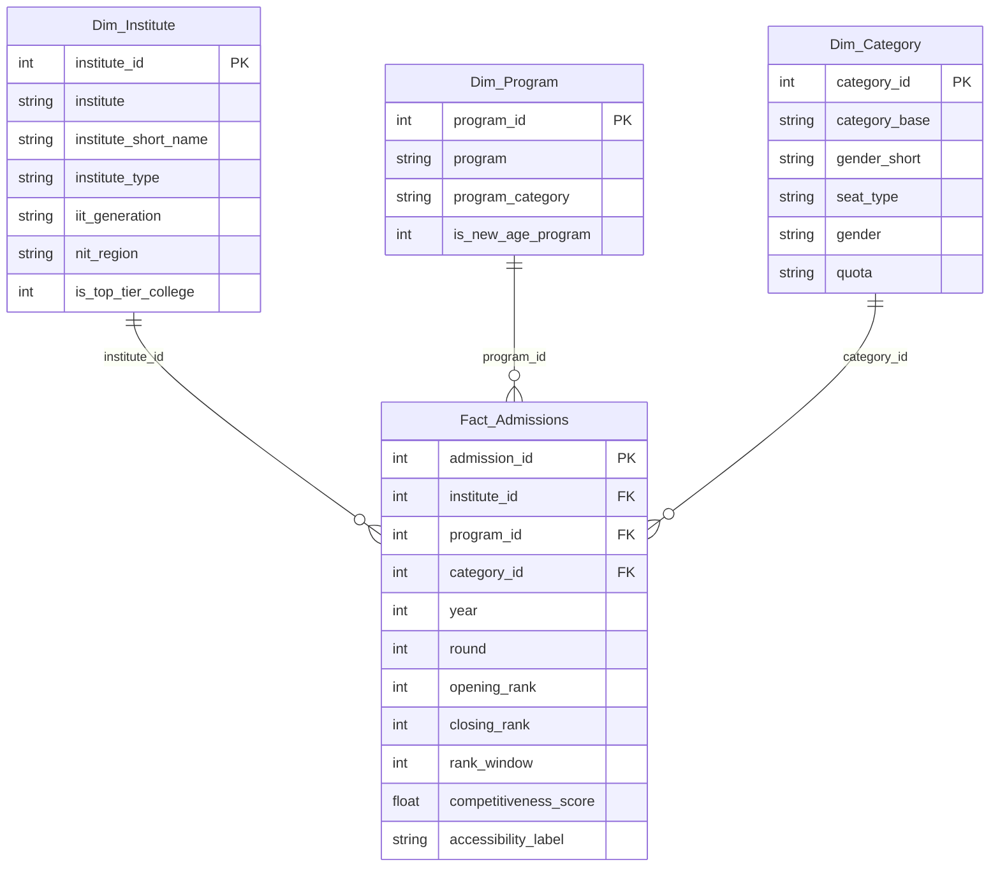

# 📊 Power BI Data Model & DAX Measures Guide
## JEE / JoSAA Admission Analytics (2018–2025)

This guide documents the **Star Schema Data Model**, relationships, step-by-step Power BI import instructions, and DAX (Data Analysis Expressions) measures for building the **JEE Admission Analytics Power BI Dashboard**.

---

## 🏛️ 1. Star Schema Data Model Architecture

The data model follows an industry-standard **Star Schema** centered around the `Fact_Admissions` table connected to 3 dimension tables via 1-to-many relationships.



---

## 🚀 2. Step-by-Step Power BI Setup Instructions

1. **Open Power BI Desktop**.
2. Click **Get Data** $\rightarrow$ **Text/CSV**.
3. Import the 4 CSV files located in `powerbi/exports/`:
   - `Dim_Institute.csv`
   - `Dim_Program.csv`
   - `Dim_Category.csv`
   - `Fact_Admissions.csv`
4. Go to **Model View** tab in Power BI.
5. Verify/create the following 1-to-Many ($1 : *$) relationships:
   - `Dim_Institute[institute_id]` $\rightarrow$ `Fact_Admissions[institute_id]`
   - `Dim_Program[program_id]` $\rightarrow$ `Fact_Admissions[program_id]`
   - `Dim_Category[category_id]` $\rightarrow$ `Fact_Admissions[category_id]`
6. Set **Cross filter direction** to `Single` (`Dim` filters `Fact`).

---

## 📐 3. DAX Measures Reference Library

Create a new table named `_Measures` in Power BI and add the following DAX expressions:

### Key Volume Metrics
```dax
// Total Admission Records
Total Admissions = COUNTROWS(Fact_Admissions)

// Unique Participating Institutes
Participating Institutes = DISTINCTCOUNT(Dim_Institute[institute_id])

// Unique Academic Programs
Total Programs = DISTINCTCOUNT(Dim_Program[program_id])
```

### Rank & Cutoff Metrics
```dax
// Median Closing Rank
Median Closing Rank = MEDIAN(Fact_Admissions[closing_rank])

// Median Opening Rank
Median Opening Rank = MEDIAN(Fact_Admissions[opening_rank])

// Average Cutoff Rank Window (Closing Rank - Opening Rank)
Avg Rank Window = AVERAGE(Fact_Admissions[rank_window])
```

### YoY Trend & Change DAX Measures
```dax
// Latest Year Closing Rank Cutoff
Latest Closing Rank = 
CALCULATE(
    MEDIAN(Fact_Admissions[closing_rank]),
    Fact_Admissions[year] = MAX(Fact_Admissions[year])
)

// Earliest Year Closing Rank Cutoff
Earliest Closing Rank = 
CALCULATE(
    MEDIAN(Fact_Admissions[closing_rank]),
    Fact_Admissions[year] = MIN(Fact_Admissions[year])
)

// YoY Closing Rank Percentage Shift
YoY Cutoff Shift % = 
VAR EarliestVal = [Earliest Closing Rank]
VAR LatestVal = [Latest Closing Rank]
RETURN
DIVIDE(LatestVal - EarliestVal, EarliestVal, 0) * 100
```

### Equity & Category Analysis DAX Measures
```dax
// Female-Only Seat Percentage
Female Seat % = 
DIVIDE(
    CALCULATE(COUNTROWS(Fact_Admissions), Dim_Category[gender_short] = "FO"),
    COUNTROWS(Fact_Admissions),
    0
) * 100

// Open Category Median Closing Rank
Open Median Cutoff = 
CALCULATE(
    MEDIAN(Fact_Admissions[closing_rank]),
    Dim_Category[category_base] = "OPEN"
)

// OBC Category Cutoff Gap (in Ranks)
OBC Cutoff Gap = 
CALCULATE(
    MEDIAN(Fact_Admissions[closing_rank]),
    Dim_Category[category_base] = "OBC-NCL"
) - [Open Median Cutoff]
```

### Interactive Student Rank Predictor DAX Measure
```dax
// Rank Cushion Margin for Selected Student Rank Parameter
Student Rank Margin = 
VAR StudentRank = SELECTEDVALUE('Student_Rank_Parameter'[Student_Rank_Parameter], 5000)
RETURN
MEDIAN(Fact_Admissions[closing_rank]) - StudentRank

// Admission Verdict Label
Admission Verdict = 
VAR Margin = [Student Rank Margin]
RETURN
SWITCH(
    TRUE(),
    Margin < -200, "🔴 Out of Reach",
    Margin < 0, "🟡 Borderline (Risky)",
    Margin <= 1500, "✅ Safe",
    "🟢 Comfortable"
)
```

---

## 🎨 4. Power BI Visual Dashboard Screenshots

The generated visual dashboard mockups located in `powerbi/dashboards/`:
1. `01_executive_overview_dashboard.png`: Key KPIs, YoY growth, and seat distribution.
2. `02_cutoff_competitiveness_dashboard.png`: Cutoffs by institute tier and category spread.
3. `03_branch_trend_analytics_dashboard.png`: YoY branch trajectories (CSE vs ECE vs ME) and top programs.
4. `04_ml_admission_predictor_dashboard.png`: Feature importance breakdown and machine learning model metrics.
